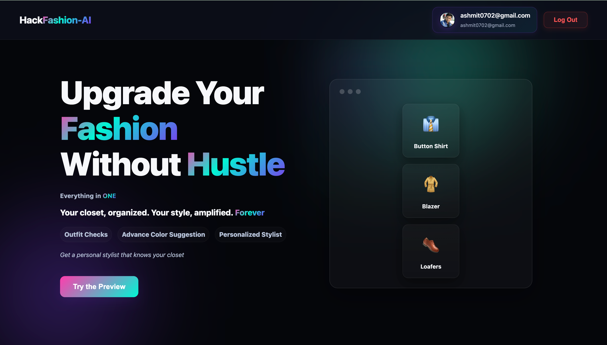
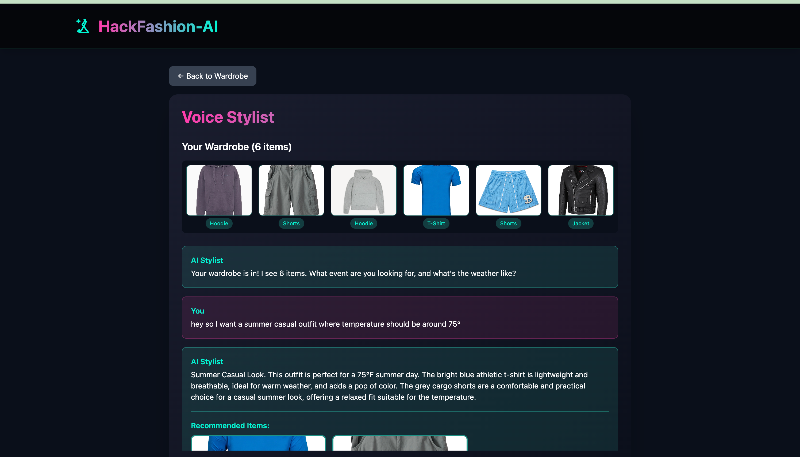
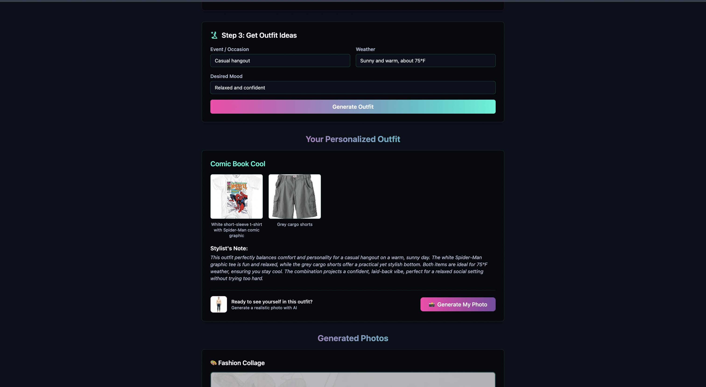
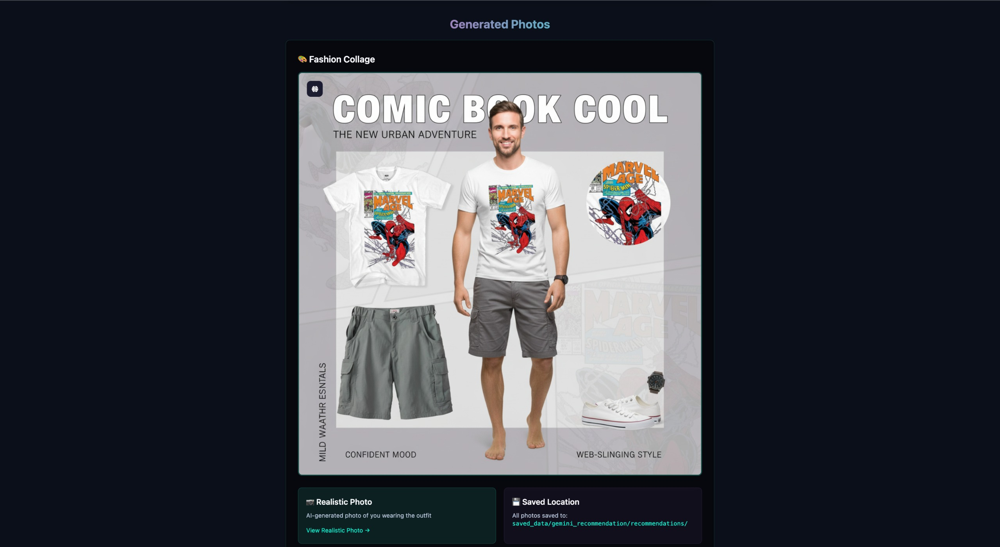

# 🎨 HackFashion-AI

> **Your AI-Powered Personal Wardrobe Stylist**

---

## 🛠️ Tech Stack

### **Frontend**
- **React 18/19** - Modern UI framework
- **TypeScript** - Type-safe development
- **Vite** - Lightning-fast build tool and dev server
- **Tailwind CSS** - Utility-first styling
- **Framer Motion** - Smooth animations

### **Backend**
- **Node.js + Express** - RESTful API server
- **Multer** - File upload handling
- **Axios** - HTTP client for external APIs
- **dotenv** - Environment variable management

### **AI & APIs**
- **Google Gemini 2.5 Flash** (`@google/genai` v1.22.0)
  - Vision API for clothing categorization
  - Chat API for conversational styling
  - JSON mode for structured responses
- **ElevenLabs API** - Premium text-to-speech synthesis
  - Natural voice narration
  - Customizable voice models
- **Web Speech API** - Browser-based speech recognition (free, client-side)
---

HackFashion-AI is an intelligent wardrobe management and styling platform that combines computer vision, natural language processing, and voice synthesis to revolutionize how you interact with your closet. Upload your clothes, chat with your AI stylist, and get personalized outfit recommendations—all powered by cutting-edge AI technology.


*Modern, Gen-Z aesthetic welcome page with smooth animations*

---

## ✨ Features

### 🖼️ **Smart Wardrobe Management**
- **AI-Powered Categorization**: Automatically categorize clothing items from photos using Google Gemini Vision API
- **Visual Gallery**: Beautiful, responsive wardrobe display with category tags
- **Quick Upload**: Drag-and-drop or click to upload multiple clothing items at once

### 🤖 **Voice Stylist (ElevenLabs Integration)**
- **Voice Conversations**: Speak to your AI stylist using voice input (Web Speech API)
- **Natural Voice Responses**: AI responds with natural, human-like voice using ElevenLabs Text-to-Speech
- **Context-Aware Recommendations**: Get outfit suggestions based on event type, weather, and personal style


*Chat with your AI stylist using voice or text - get personalized outfit recommendations*

### 👔 **Intelligent Outfit Generation**
- **Smart Matching**: AI analyzes your wardrobe and creates cohesive outfit combinations
- **Visual Previews**: See recommended outfit items with images
- **Personalized Justifications**: Understand why each outfit works for your occasion

### 🎯 **Event-Based Styling**
- Get recommendations tailored to:
  - Event type (casual, formal, business, athletic, etc.)
  - Weather conditions
  - Personal preferences
  - Body type and color preferences


---
## 📖 How to Use

### **Upload Your Wardrobe**
1. Navigate to the Features page
2. Click "Upload Wardrobe"
3. Select or drag-drop clothing images (PNG, JPG, WEBP)
4. AI automatically categorizes each item (T-shirt, Jeans, Hoodie, etc.)

### **Chat with Voice Stylist**
1. Click "Voice Stylist" from the Features page
2. Your wardrobe is displayed at the top
3. **Type** your request OR **Click the microphone** 🎤 to speak
4. Example prompts:
   - "Show me outfit for summer casual"
   - "What should I wear to a business meeting?"
   - "Give me a comfortable outfit for the gym"
5. AI responds with:
   - Text explanation
   - **Voice narration** (auto-plays via ElevenLabs)
   - **Visual outfit preview** with matched wardrobe items




*AI-generated outfit with visual item preview and voice narration*


## 🎨 Features Showcase

### **AI Categorization**
- Powered by **Gemini 2.5 Flash Vision API**
- Identifies clothing type, color, style, and material
- Returns structured JSON for easy processing

### **Voice Stylist**
- **Speech Input**: Web Speech API (browser-based, free)
- **Voice Output**: ElevenLabs premium TTS
- **Real-time chat** with context awareness
- **Visual outfit display** with fuzzy matching algorithm

### **Smart Outfit Matching**
- Analyzes wardrobe items
- Considers event type and weather
- Provides fashion justification
- Displays matched items with images

---

## 📁 Repository Structure

```
HackFashion-AI/
├── index.html                      # Main landing page entry
├── package.json                    # Main app dependencies
├── vite.config.js                  # Main app Vite config
│
├── src/                            # Landing page source
│   ├── App.jsx                     # Main app component
│   ├── main.jsx                    # React entry point
│   ├── styles.css                  # Global styles
│   ├── components/                 # Landing page components
│   │   ├── Hero.jsx                # Hero section
│   │   ├── Features.jsx            # Features showcase
│   │   ├── FeaturesPage.jsx        # Features detail page
│   │   ├── Benefits.jsx            # Benefits section
│   │   └── CTA.jsx                 # Call-to-action
│   └── hooks/                      # Custom React hooks
│       ├── useTheme.js             # Theme management
│       └── useUploadPreview.js     # Upload preview logic
│
├── server/                         # Backend API server
│   ├── index.js                    # Express server + API routes
│   ├── package.json                # Server dependencies
│   ├── .env                        # Environment variables (DO NOT COMMIT)
│   └── uploads/                    # Uploaded images storage
│
└── Ashar/ai-wardrobe-stylist/     # Wardrobe Stylist App
    ├── App.tsx                     # Main stylist app
    ├── vite.config.ts              # Vite config with proxy
    ├── package.json                # App dependencies
    ├── components/                 # React components
    │   ├── VoiceStylist.tsx        # Voice chat interface
    │   ├── Wardrobe.tsx            # Wardrobe manager
    │   ├── ImageUploader.tsx       # Image upload UI
    │   └── OutfitSuggestions.tsx   # Outfit display
    └── services/
        └── geminiService.ts        # API service layer
```

---

## 🚀 Getting Started

### Prerequisites

- **Node.js** (v18 or higher)
- **npm** or **yarn**
- **API Keys**:
  - [Google Gemini API Key](https://makersuite.google.com/app/apikey)
  - [ElevenLabs API Key](https://elevenlabs.io/)

### Installation & Setup

#### **Option 1: Quick Start (Recommended) 🎯**

Use the automated script to install and run everything:

```bash
chmod +x start-all.sh
./start-all.sh
```

This will:
- Install all dependencies for main app, server, and AI stylist
- Start the backend server on `http://localhost:4000`
- Start the main landing page on `http://localhost:3000` (or available port)
- Start the AI Wardrobe Stylist on `http://localhost:5173`

Press `Ctrl+C` to stop all servers.

---

#### **Option 2: Manual Setup 🔧**

**1. Clone the Repository**
```bash
git clone https://github.com/ashmitKmishra/HackFashion-AI.git
cd HackFashion-AI
```

**2. Set Up Environment Variables**

Create `.env` file in the `server/` directory:

```bash
cd server
cat > .env << EOF
# Google Gemini API Key
GEMINI_API_KEY=your_gemini_api_key_here

# ElevenLabs API Configuration
ELEVENLABS_API_KEY=your_elevenlabs_api_key_here
ELEVENLABS_VOICE_ID=your_preferred_voice_id
ELEVENLABS_HOST=https://api.elevenlabs.io

# Server Port
PORT=4000
EOF
```

**3. Install Dependencies**

```bash
# Install server dependencies
cd server
npm install

# Install main app dependencies
cd ..
npm install

# Install AI Wardrobe Stylist dependencies
cd Ashar/ai-wardrobe-stylist
npm install
cd ../..
```

**4. Start the Applications**

Open **three separate terminals**:

**Terminal 1 - Backend Server:**
```bash
cd server
node index.js
# Server runs on http://localhost:4000
```

**Terminal 2 - Main Landing Page:**
```bash
npm run dev
# Typically runs on http://localhost:3000 or 3001
```

**Terminal 3 - AI Wardrobe Stylist:**
```bash
cd Ashar/ai-wardrobe-stylist
npm run dev
# Runs on http://localhost:5173
```

---

### 🔑 API Keys Setup

#### **Google Gemini API**
1. Visit [Google AI Studio](https://makersuite.google.com/app/apikey)
2. Sign in with your Google account
3. Click "Get API Key"
4. Copy your API key to `server/.env` as `GEMINI_API_KEY`

#### **ElevenLabs API**
1. Visit [ElevenLabs](https://elevenlabs.io/)
2. Sign up for an account
3. Navigate to your [Profile Settings](https://elevenlabs.io/app/settings/api-keys)
4. Generate an API key
5. Choose a voice from the [Voice Library](https://elevenlabs.io/voice-library) and copy its Voice ID
6. Add both to `server/.env`:
   - `ELEVENLABS_API_KEY` - Your API key
   - `ELEVENLABS_VOICE_ID` - Your chosen voice ID (default: `NDTYOmYEjbDIVCKB35i3`)

---


## 🐛 Troubleshooting

### **Server Error 500 when uploading**
- Ensure backend server is running: `cd server && node index.js`
- Check `.env` file exists in `server/` directory
- Verify `GEMINI_API_KEY` is set correctly
- Check server logs for detailed error messages

### **No voice output**
- Verify `ELEVENLABS_API_KEY` is set in `server/.env`
- Check browser console for TTS errors
- Ensure audio playback is not blocked by browser

### **Voice input not working**
- Use Chrome, Edge, or Safari (Web Speech API supported)
- Grant microphone permissions when prompted
- Check browser console for speech recognition errors

### **EPERM or uv_cwd errors (macOS)**
- Grant Terminal access: **System Settings → Privacy & Security → Files and Folders → Terminal**
- Or move project: `mv ~/Desktop/HackFashion-AI ~/Projects/`

---

## 🚢 Deployment

### **Production Environment Variables**
Replace development URLs in production:
- Update iframe URLs in `src/components/FeaturesPage.jsx`
- Set production API endpoint in Vite proxy config
- **Never commit `.env` files** - use environment variable managers

### **Recommended Hosting**
- **Frontend**: Netlify, Vercel, or Cloudflare Pages
- **Backend**: Railway, Render, or AWS EC2
- **Storage**: AWS S3 or Cloudinary for uploaded images

---

## 🗺️ Roadmap

- [x] Landing page with Gen-Z aesthetic
- [x] Image upload and categorization (Gemini Vision)
- [x] Voice Stylist with ElevenLabs TTS
- [x] Speech-to-text input (Web Speech API)
- [x] Visual outfit recommendations
- [ ] User authentication & accounts
- [ ] Persistent wardrobe storage (Database)
- [ ] Weather API integration
- [ ] Body type and color analysis
- [ ] Outfit history and favorites
- [ ] Social sharing features
- [ ] Mobile app (React Native)

---

## 🤝 Contributing

We welcome contributions! Here's how you can help:

1. **Fork** the repository
2. **Create** a feature branch (`git checkout -b feature/AmazingFeature`)
3. **Commit** your changes (`git commit -m 'Add some AmazingFeature'`)
4. **Push** to the branch (`git push origin feature/AmazingFeature`)
5. **Open** a Pull Request

### Priority Features
- Improved wardrobe categorization accuracy
- Additional voice models and languages
- Outfit rating and feedback system
- Integration with fashion e-commerce APIs

---

## 📄 License

This project is licensed under the **MIT License** - see the [LICENSE](LICENSE) file for details.

---

## 👨‍💻 Author & Contributers

**Ashmit Mishra** - [@ashmitKmishra](https://github.com/ashmitKmishra)<br>
**Ashwani Mishra** - [@ashwani564](https://github.com/Ashwani564)<br>
**Muhammad Ashar Mian** - [@Muhammadasharmian](https://github.com/Muhammadasharmian) <br>
**Mohnish Sao** - [@mohnish-dev](https://github.com/mohnish-dev)

---

## 🙏 Acknowledgments

- **Google Gemini** for powerful vision and language AI
- **ElevenLabs** for natural voice synthesis
- **Web Speech API** for browser-based speech recognition
- **React & Vite** community for amazing developer tools

---

## 📞 Support

- 🐛 **Issues**: [GitHub Issues](https://github.com/ashmitKmishra/HackFashion-AI/issues)
- 📧 **Email**: Open an issue for contact

---

<div align="center">

**⭐ Star this repo if you find it helpful!**

Made with ❤️

</div>
